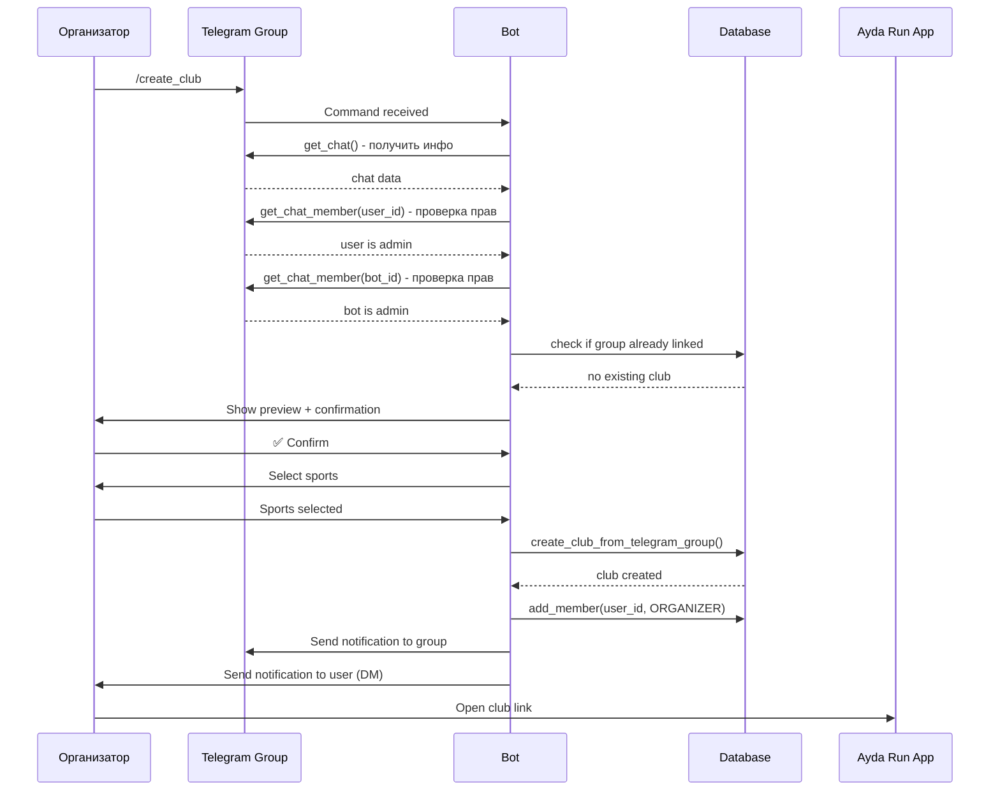

# План реализации: Интеграция с Telegram группами для автоматического создания клубов

**Дата создания:** 2025-12-19
**Статус:** 🔵 Планирование

---

## Общая информация

**Цель:** Автоматизировать создание клубов на основе данных из существующих Telegram групп

**Сценарий использования:**
1. Организатор добавляет бота в Telegram группу как администратора
2. Организатор вызывает команду `/create_club` в группе
3. Бот парсит информацию о группе
4. Бот создает клуб в приложении на основе спарсенных данных
5. Организатор получает подтверждение и ссылку на клуб в приложении

**Приоритет:** P1 (важно для упрощения онбординга организаторов)

---

## Архитектура решения

```
┌─────────────────────────────────────────────────────────────┐
│                  ИНТЕГРАЦИЯ С ГРУППАМИ                      │
├─────────────────────────────────────────────────────────────┤
│                                                             │
│  1. Group Info Parser                                       │
│     - Название группы                                       │
│     - Описание (из chat.description)                        │
│     - Количество участников (из chat.member_count)          │
│     - Username группы (@groupname)                          │
│     - Invite link                                           │
│     - Аватар группы                                         │
│                                                             │
│  2. Admin Verification                                      │
│     - Проверка, что бот является админом                    │
│     - Проверка, что пользователь является админом/creator   │
│                                                             │
│  3. Club Creation Handler                                   │
│     - Создание клуба на основе данных группы                │
│     - Связывание клуба с Telegram группой                   │
│     - Добавление создателя как организатора                 │
│                                                             │
│  4. Permissions & Settings                                  │
│     - Проверка необходимых прав бота                        │
│     - Настройка уведомлений в группе                        │
│                                                             │
└─────────────────────────────────────────────────────────────┘
```

---

## Фазы реализации

### 📋 ФАЗА 1: Group Info Parser и проверки

**Цель:** Получить всю доступную информацию о группе и проверить права

#### Task 1.1: Создать Group Info Parser

**Файл:** `bot/group_parser.py`

```python
class TelegramGroupParser:
    """
    Парсер информации о Telegram группе

    Извлекает:
    - Базовую информацию (название, описание, username)
    - Статистику (количество участников)
    - Медиа (аватар группы)
    - Ссылки (invite link)
    """

    async def parse_group_info(self, chat_id: int, bot: Bot) -> dict:
        """
        Получить информацию о группе

        Returns:
            {
                'chat_id': int,
                'title': str,
                'description': str,
                'username': str,  # @groupname
                'member_count': int,
                'invite_link': str,
                'photo': str,  # file_id аватара
                'type': str,  # 'group' или 'supergroup'
            }
        """
        pass

    async def get_group_photo(self, chat_id: int, bot: Bot) -> Optional[str]:
        """Получить file_id аватара группы"""
        pass

    async def get_member_count(self, chat_id: int, bot: Bot) -> int:
        """Получить количество участников"""
        pass

    async def get_invite_link(self, chat_id: int, bot: Bot) -> Optional[str]:
        """Получить или создать invite link"""
        pass
```

**Что парсим:**

| Данные | Telegram API | Маппинг в Club |
|--------|--------------|----------------|
| Название | `chat.title` | `club.name` |
| Описание | `chat.description` | `club.description` |
| Username | `chat.username` | `club.username` |
| Участники | `chat.get_member_count()` | Для информации |
| Invite link | `chat.invite_link` или `export_chat_invite_link()` | `club.invite_link` |
| Аватар | `chat.photo.big_file_id` | `club.photo` |
| Chat ID | `chat.id` | `club.telegram_chat_id` |

**Статус:** ⬜ Не начато

---

#### Task 1.2: Создать Admin Verification

**Файл:** `bot/group_parser.py` (дополнение)

```python
class TelegramGroupParser:

    async def verify_bot_is_admin(self, chat_id: int, bot: Bot) -> bool:
        """
        Проверить, что бот является администратором группы

        Требуемые права:
        - can_invite_users (для создания invite links)
        - can_read_messages (для получения информации)
        """
        pass

    async def verify_user_is_admin(self, chat_id: int, user_id: int, bot: Bot) -> bool:
        """
        Проверить, что пользователь является администратором или создателем
        """
        pass

    async def get_user_status(self, chat_id: int, user_id: int, bot: Bot) -> str:
        """
        Получить статус пользователя в группе

        Returns: 'creator', 'administrator', 'member', 'restricted', 'left', 'kicked'
        """
        pass
```

**Статус:** ⬜ Не начато

---

### 📦 ФАЗА 2: Club Creation Handler

**Цель:** Обработка команды `/create_club` в группе

#### Task 2.1: Создать handler для команды `/create_club`

**Файл:** `bot/group_integration_handler.py`

```python
async def create_club_from_group(update: Update, context: ContextTypes.DEFAULT_TYPE) -> None:
    """
    Handler для команды /create_club в группе

    Flow:
    1. Проверить, что команда вызвана в группе (не в ЛС)
    2. Проверить, что пользователь - админ/создатель группы
    3. Проверить, что бот - админ группы
    4. Проверить, что группа еще не связана с клубом
    5. Спарсить информацию о группе
    6. Показать превью клуба пользователю
    7. Запросить подтверждение
    8. Создать клуб
    9. Отправить уведомление в группу и пользователю
    """
    pass
```

**States для ConversationHandler:**

```python
# States
CONFIRMING_CLUB_CREATION = 1
EDITING_CLUB_DATA = 2
SELECTING_SPORTS = 3
FINALIZING = 4
```

**Пример flow:**

```
Пользователь: /create_club

Бот:
📋 Создание клуба на основе группы "Trail Runners Moscow"

Я нашел следующую информацию:
▪️ Название: Trail Runners Moscow
▪️ Описание: Клуб любителей трейлраннинга в Москве
▪️ Участников: 127
▪️ Группа: @trailrunmoscow

Хотите создать клуб с этими данными?
[Кнопки: ✅ Создать | ✏️ Редактировать | ❌ Отменить]

Пользователь: ✅ Создать

Бот:
Выберите виды спорта для клуба:
[Кнопки: Бег | Трейл | Лыжи | ... | Продолжить]

Пользователь: Трейл, Бег → Продолжить

Бот:
✅ Клуб "Trail Runners Moscow" успешно создан!

🔗 Ссылка: https://aydarun.app/clubs/abc-123
👤 Вы назначены организатором клуба

Теперь участники группы могут вступить в клуб через приложение.
```

**Статус:** ⬜ Не начато

---

#### Task 2.2: Создать Preview и Confirmation

**Файл:** `bot/group_integration_handler.py`

```python
async def show_club_preview(
    update: Update,
    context: ContextTypes.DEFAULT_TYPE,
    group_data: dict
) -> int:
    """
    Показать превью будущего клуба на основе данных группы
    """
    pass

async def handle_club_confirmation(update: Update, context: ContextTypes.DEFAULT_TYPE) -> int:
    """
    Обработка подтверждения создания клуба
    """
    pass

async def handle_edit_club_data(update: Update, context: ContextTypes.DEFAULT_TYPE) -> int:
    """
    Режим редактирования данных клуба перед созданием
    Позволяет изменить:
    - Название
    - Описание
    - Виды спорта
    """
    pass
```

**Статус:** ⬜ Не начато

---

#### Task 2.3: Создание клуба в БД

**Файл:** `storage/club_storage.py` (дополнение)

```python
class ClubStorage:

    def create_club_from_telegram_group(
        self,
        creator_id: str,
        group_data: dict,
        sports: List[str]
    ) -> Club:
        """
        Создать клуб на основе данных Telegram группы

        Args:
            creator_id: ID пользователя-создателя
            group_data: Данные из TelegramGroupParser
            sports: Выбранные виды спорта

        Returns:
            Club: Созданный клуб

        Raises:
            ValueError: Если группа уже связана с клубом
        """
        # Проверить, что группа не связана с другим клубом
        existing_club = self.get_club_by_telegram_chat_id(group_data['chat_id'])
        if existing_club:
            raise ValueError(f"Группа уже связана с клубом {existing_club.name}")

        # Создать клуб
        club = Club(
            name=group_data['title'],
            description=group_data.get('description'),
            creator_id=creator_id,
            username=group_data.get('username'),
            telegram_chat_id=group_data['chat_id'],
            invite_link=group_data.get('invite_link'),
            photo=group_data.get('photo'),
            # ... остальные поля
        )

        # Сохранить sports в JSON
        # Добавить создателя как ORGANIZER
        # ...

        return club

    def get_club_by_telegram_chat_id(self, chat_id: int) -> Optional[Club]:
        """Получить клуб по telegram_chat_id"""
        pass
```

**Статус:** ⬜ Не начато

---

### 🔔 ФАЗА 3: Уведомления и финализация

#### Task 3.1: Уведомления после создания клуба

**Файл:** `bot/group_integration_handler.py`

```python
async def send_club_created_notification_to_group(
    chat_id: int,
    club: Club,
    bot: Bot
) -> None:
    """
    Отправить уведомление в группу о создании клуба

    Сообщение:
    - Клуб создан
    - Ссылка на клуб в приложении
    - Призыв вступить
    - Информация о боте
    """
    pass

async def send_club_created_notification_to_organizer(
    user_id: int,
    club: Club,
    bot: Bot
) -> None:
    """
    Отправить уведомление организатору в ЛС

    Сообщение:
    - Поздравление
    - Ссылка на клуб
    - Инструкции по управлению
    - Invite link для участников
    """
    pass
```

**Пример уведомления в группу:**

```
🎉 Клуб создан в Ayda Run!

Теперь "Trail Runners Moscow" доступен в приложении Ayda Run!

🔗 Вступить в клуб: https://aydarun.app/clubs/abc-123

Что дает вам клуб:
✅ Календарь тренировок
✅ Участие в забегах
✅ Статистика и достижения
✅ Общение с бегунами

Откройте приложение: [Кнопка WebApp]
```

**Статус:** ⬜ Не начато

---

#### Task 3.2: Добавить deep link для быстрого вступления

**Файл:** `bot/group_integration_handler.py`

```python
def generate_club_join_link(club_id: str, bot_username: str) -> str:
    """
    Генерировать deep link для вступления в клуб

    Returns: https://t.me/yourbot?start=club_<UUID>
    """
    return f"https://t.me/{bot_username}?start=club_{club_id}"
```

**Использование:**
- В уведомлении в группу добавить кнопку с deep link
- Пользователи кликают и сразу вступают в клуб (Flow 2A)

**Статус:** ⬜ Не начато

---

### ✅ ФАЗА 4: Проверки и edge cases

#### Task 4.1: Обработка ошибок и edge cases

**Сценарии для обработки:**

1. **Бот не админ группы**
   ```
   ❌ Ошибка: Я не являюсь администратором группы

   Чтобы создать клуб, добавьте меня как администратора с правами:
   - Приглашать пользователей
   - Читать сообщения
   ```

2. **Пользователь не админ группы**
   ```
   ❌ Ошибка: У вас нет прав для создания клуба

   Только администраторы и создатель группы могут создавать клубы.
   ```

3. **Группа уже связана с клубом**
   ```
   ❌ Группа уже связана с клубом "Trail Runners Moscow"

   🔗 Перейти в клуб: https://aydarun.app/clubs/abc-123
   ```

4. **Команда вызвана в ЛС, а не в группе**
   ```
   ℹ️ Эта команда работает только в группах

   Добавьте меня в группу и вызовите /create_club там.
   ```

5. **Недостаточно информации о группе**
   ```
   ⚠️ Не удалось получить полную информацию о группе

   Убедитесь, что:
   - Группа является супергруппой
   - У бота есть необходимые права
   ```

**Файл:** `bot/group_integration_handler.py`

```python
class GroupIntegrationError(Exception):
    """Базовая ошибка интеграции с группой"""
    pass

class BotNotAdminError(GroupIntegrationError):
    """Бот не является администратором"""
    pass

class UserNotAdminError(GroupIntegrationError):
    """Пользователь не является администратором"""
    pass

class GroupAlreadyLinkedError(GroupIntegrationError):
    """Группа уже связана с клубом"""
    pass

class NotInGroupError(GroupIntegrationError):
    """Команда вызвана не в группе"""
    pass
```

**Статус:** ⬜ Не начато

---

#### Task 4.2: Валидация данных группы

**Файл:** `bot/validators.py` (дополнение)

```python
def validate_group_data(group_data: dict) -> tuple[bool, str]:
    """
    Валидация данных группы перед созданием клуба

    Проверки:
    - Название не пустое и не слишком короткое
    - Chat ID корректный
    - Тип чата - группа или супергруппа
    """
    if not group_data.get('title'):
        return False, "Название группы не найдено"

    if len(group_data['title']) < 3:
        return False, "Название группы слишком короткое"

    if group_data.get('type') not in ['group', 'supergroup']:
        return False, "Неподдерживаемый тип чата"

    return True, "OK"
```

**Статус:** ⬜ Не начато

---

### 🧪 ФАЗА 5: Тестирование

#### Task 5.1: Unit тесты

**Файл:** `tests/test_bot/test_group_integration.py`

```python
class TestGroupParser:
    """Тесты парсера информации о группе"""

    def test_parse_group_info(self):
        """Тест парсинга базовой информации"""
        pass

    def test_verify_bot_is_admin(self):
        """Тест проверки прав бота"""
        pass

    def test_verify_user_is_admin(self):
        """Тест проверки прав пользователя"""
        pass

class TestClubCreationFromGroup:
    """Тесты создания клуба из группы"""

    def test_create_club_from_group_success(self):
        """Тест успешного создания клуба"""
        pass

    def test_create_club_group_already_linked(self):
        """Тест попытки создать клуб для уже связанной группы"""
        pass

    def test_create_club_bot_not_admin(self):
        """Тест когда бот не админ"""
        pass

class TestGroupIntegrationErrors:
    """Тесты обработки ошибок"""

    def test_not_in_group_error(self):
        pass

    def test_user_not_admin_error(self):
        pass
```

**Статус:** ⬜ Не начато

---

#### Task 5.2: Integration тесты

**Сценарии для тестирования:**

1. **Happy path**: Админ группы создает клуб
2. **Edge case**: Попытка создать второй клуб для той же группы
3. **Error handling**: Бот не админ
4. **Error handling**: Пользователь не админ
5. **Validation**: Некорректные данные группы

**Статус:** ⬜ Не начато

---

### 📚 ФАЗА 6: Документация

#### Task 6.1: Обновить документацию

**Файлы для обновления:**

1. **`docs/bot/GROUP_INTEGRATION.md`** (новый)
   - Как работает интеграция
   - Команды для групп
   - Необходимые права бота
   - FAQ и troubleshooting

2. **`docs/bot/ONBOARDING.md`** (дополнить)
   - Добавить Flow 4: Создание клуба из группы

3. **`README.md`** (обновить)
   - Добавить информацию о group integration

**Статус:** ⬜ Не начато

---

## Технические детали

### Права бота в группе

**Необходимые права администратора:**

| Право | Зачем нужно |
|-------|-------------|
| `can_read_messages` | Получать информацию о группе |
| `can_invite_users` | Создавать invite links |
| `can_delete_messages` | Удалять spam (опционально) |
| `can_restrict_members` | Модерация (опционально) |

### Telegram API методы

```python
# Получение информации о чате
chat = await bot.get_chat(chat_id)

# Получение количества участников
member_count = await bot.get_chat_member_count(chat_id)

# Проверка статуса пользователя
member = await bot.get_chat_member(chat_id, user_id)

# Создание invite link
invite_link = await bot.export_chat_invite_link(chat_id)

# Получение аватара группы
photos = await bot.get_user_profile_photos(chat_id)
```

### Связь Club ↔ Telegram Group

**В модели Club уже есть:**
```python
telegram_chat_id = Column(Integer, nullable=True)  # Telegram chat ID группы
invite_link = Column(String(500), nullable=True)   # Invite link группы
username = Column(String(255), nullable=True)      # @groupname
photo = Column(String(255), nullable=True)         # Avatar file_id
```

**Дополнительно может понадобиться:**
```python
# В модели Club
is_auto_created = Column(Boolean, default=False)  # Создан автоматически из группы
telegram_group_synced_at = Column(DateTime)       # Дата последней синхронизации
```

---

## Итоговый чеклист задач

### ✅ Фаза 1: Group Info Parser
- [ ] Создать TelegramGroupParser class
- [ ] Реализовать parse_group_info()
- [ ] Реализовать verify_bot_is_admin()
- [ ] Реализовать verify_user_is_admin()
- [ ] Добавить получение аватара группы
- [ ] Добавить получение invite link

### ✅ Фаза 2: Club Creation Handler
- [ ] Создать group_integration_handler.py
- [ ] Реализовать create_club_from_group command handler
- [ ] Реализовать show_club_preview()
- [ ] Реализовать handle_club_confirmation()
- [ ] Реализовать handle_edit_club_data()
- [ ] Добавить sports selection для группы
- [ ] Дополнить ClubStorage.create_club_from_telegram_group()
- [ ] Зарегистрировать handler в api_server.py

### ✅ Фаза 3: Уведомления
- [ ] Реализовать send_club_created_notification_to_group()
- [ ] Реализовать send_club_created_notification_to_organizer()
- [ ] Добавить generate_club_join_link()
- [ ] Создать keyboards для уведомлений
- [ ] Создать тексты сообщений

### ✅ Фаза 4: Проверки и edge cases
- [ ] Создать custom exceptions
- [ ] Реализовать обработку BotNotAdminError
- [ ] Реализовать обработку UserNotAdminError
- [ ] Реализовать обработку GroupAlreadyLinkedError
- [ ] Реализовать обработку NotInGroupError
- [ ] Добавить validate_group_data()

### ✅ Фаза 5: Тестирование
- [ ] Создать tests/test_bot/test_group_integration.py
- [ ] Написать unit тесты для TelegramGroupParser
- [ ] Написать integration тесты для создания клуба
- [ ] Написать тесты для error handling
- [ ] Провести manual testing в реальной группе

### ✅ Фаза 6: Документация
- [ ] Создать docs/bot/GROUP_INTEGRATION.md
- [ ] Обновить docs/bot/ONBOARDING.md
- [ ] Обновить README.md
- [ ] Добавить примеры использования

---

## Оценка трудозатрат

| Фаза | Задачи | Приоритет | Сложность | Время |
|------|--------|-----------|-----------|-------|
| Фаза 1 | Group Parser | P0 | Medium | 3-4 часа |
| Фаза 2 | Club Creation | P0 | High | 4-5 часов |
| Фаза 3 | Уведомления | P1 | Low | 2-3 часа |
| Фаза 4 | Edge Cases | P0 | Medium | 2-3 часа |
| Фаза 5 | Тестирование | P1 | Medium | 3-4 часа |
| Фаза 6 | Документация | P2 | Low | 1-2 часа |

**Итого:** 15-21 час

---

## Зависимости и риски

**Зависимости:**
- ✅ python-telegram-bot библиотека
- ✅ Существующие модели БД (Club, User, Membership)
- ✅ Onboarding flow (Flow 1-3)
- ⚠️ Бот должен быть админом группы

**Риски:**

| Риск | Вероятность | Воздействие | Митигация |
|------|-------------|-------------|-----------|
| Недостаточные права бота | Высокая | Среднее | Четкие инструкции пользователю |
| API rate limits Telegram | Низкая | Высокое | Кэширование данных, retry логика |
| Группа удалена/бот кикнут | Средняя | Среднее | Периодическая проверка доступности |
| Конфликт названий клубов | Низкая | Низкое | Добавление суффикса при дубле |

---

## Примеры использования

### Пример 1: Создание клуба из группы

```
# В группе Trail Runners Moscow

Организатор: /create_club

Бот:
📋 Создание клуба "Trail Runners Moscow"

Найденная информация:
▪️ Название: Trail Runners Moscow
▪️ Описание: Клуб для любителей трейлраннинга
▪️ Участников: 127
▪️ Группа: @trailrunmoscow

[✅ Создать | ✏️ Редактировать | ❌ Отменить]

Организатор: ✅ Создать

Бот:
Выберите виды спорта:
[Бег | Трейл ✓ | Лыжи | Велосипед | Продолжить →]

Организатор: Продолжить →

Бот (в группу):
🎉 Клуб "Trail Runners Moscow" создан!

Вступить: https://t.me/yourbot?start=club_abc123
Или откройте приложение: [WebApp Button]

Бот (в ЛС организатору):
✅ Поздравляем! Клуб "Trail Runners Moscow" создан.

Вы назначены организатором клуба.

🔗 Управление клубом: https://aydarun.app/clubs/abc-123
📲 Invite link: https://t.me/yourbot?start=club_abc123

Поделитесь ссылкой в группе, чтобы участники могли вступить!
```

---

## Диаграмма последовательности



---

**Статус:** 📋 **Готов к реализации**

**Следующий шаг:** Начать с Фазы 1 - создание Group Parser
