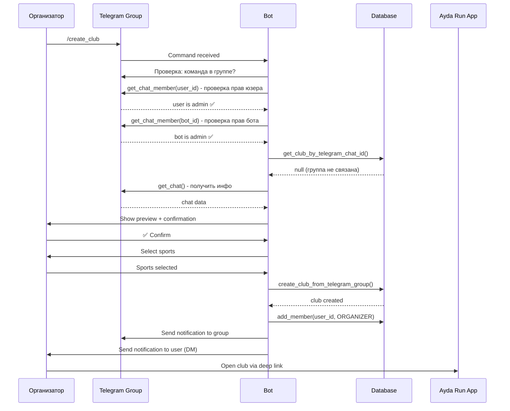

# План реализации: Интеграция с Telegram группами для автоматического создания клубов

**Дата создания:** 2025-12-19
**Дата обновления:** 2025-12-19
**Статус:** 🔵 Планирование (обновлён)

---

## Общая информация

**Цель:** Автоматизировать создание клубов на основе данных из существующих Telegram групп

**Сценарий использования:**
1. Организатор добавляет бота в Telegram группу как администратора
2. Организатор вызывает команду `/create_club` в группе
3. Бот парсит информацию о группе
4. Бот создает клуб в приложении на основе спарсенных данных
5. Организатор получает подтверждение и ссылку на клуб в приложении

**Приоритет:** P1 (важно для упрощения онбординга организаторов)

---

## Изменения в плане (2025-12-19)

### ✅ Что уже готово в кодовой базе:
- ✅ Модели БД: `telegram_chat_id`, `invite_link`, `username`, `photo` в Club/Group
- ✅ Storage Layer: UserStorage, ClubStorage, GroupStorage, MembershipStorage
- ✅ Deep links: формат `club_{UUID}` и `group_{UUID}` уже работает
- ✅ WebApp deep links: `{app_url}?startapp=club_{UUID}`

### 🔧 Корректировки архитектуры:
- ✅ **Добавлен** `BOT_USERNAME` в config.py для корректных deep links
- 🔄 **Изменён** handler: `bot/group_club_creation_handler.py` вместо `group_integration_handler.py`
- 🔄 **Упрощена** архитектура: используем существующие паттерны из onboarding
- ➕ **Добавлены** методы в ClubStorage: `get_club_by_telegram_chat_id()`, `create_club_from_telegram_group()`

### 📝 Будущие улучшения (отложено):
- ⏳ **Синхронизация данных группы** - команда `/update_club` (позже)
- ⏳ **Обработка удаления бота** - webhook `my_chat_member` (позже, требует логику в приложении)

---

## Архитектура решения

```
┌─────────────────────────────────────────────────────────────┐
│                  ИНТЕГРАЦИЯ С ГРУППАМИ                      │
├─────────────────────────────────────────────────────────────┤
│                                                             │
│  1. TelegramGroupParser (bot/group_parser.py)               │
│     - Парсинг информации о группе                           │
│     - Проверка прав бота и пользователя                     │
│     - Получение аватара и invite link                       │
│                                                             │
│  2. GroupClubCreationHandler (bot/group_club_creation_handler.py) │
│     - ConversationHandler для /create_club в группах        │
│     - Preview → Confirmation → Sports → Creation            │
│     - Использует TelegramGroupParser                        │
│                                                             │
│  3. ClubStorage (дополнения)                                │
│     - create_club_from_telegram_group()                     │
│     - get_club_by_telegram_chat_id()                        │
│                                                             │
│  4. Deep Links генерация                                    │
│     - https://t.me/{BOT_USERNAME}?start=club_{UUID}         │
│     - {WEB_APP_URL}?startapp=club_{UUID}                    │
│                                                             │
└─────────────────────────────────────────────────────────────┘
```

---

## Фазы реализации

### 📋 ФАЗА 1: Group Info Parser и проверки

**Цель:** Получить всю доступную информацию о группе и проверить права

#### Task 1.1: Создать TelegramGroupParser

**Файл:** `bot/group_parser.py`

```python
"""
Telegram Group Parser

Парсит информацию о Telegram группах для создания клубов.
"""

from typing import Optional, Dict, Any
from telegram import Bot, ChatMember
import logging

logger = logging.getLogger(__name__)


class TelegramGroupParser:
    """
    Парсер информации о Telegram группе

    Извлекает:
    - Базовую информацию (название, описание, username)
    - Статистику (количество участников)
    - Медиа (аватар группы)
    - Ссылки (invite link)
    """

    async def parse_group_info(self, chat_id: int, bot: Bot) -> Dict[str, Any]:
        """
        Получить информацию о группе

        Returns:
            {
                'chat_id': int,
                'title': str,
                'description': str,
                'username': str,  # @groupname (без @)
                'member_count': int,
                'invite_link': str,
                'photo': str,  # file_id аватара
                'type': str,  # 'group' или 'supergroup'
            }
        """
        try:
            # Получить информацию о чате
            chat = await bot.get_chat(chat_id)

            # Получить количество участников
            member_count = await bot.get_chat_member_count(chat_id)

            # Получить invite link (или создать если нет)
            invite_link = await self.get_invite_link(chat_id, bot)

            # Получить аватар
            photo_file_id = await self.get_group_photo(chat_id, bot)

            return {
                'chat_id': chat_id,
                'title': chat.title,
                'description': chat.description or '',
                'username': chat.username or '',  # Без @
                'member_count': member_count,
                'invite_link': invite_link,
                'photo': photo_file_id,
                'type': chat.type,  # 'group' или 'supergroup'
            }

        except Exception as e:
            logger.error(f"Error parsing group info for {chat_id}: {e}", exc_info=True)
            raise

    async def get_group_photo(self, chat_id: int, bot: Bot) -> Optional[str]:
        """
        Получить file_id аватара группы

        Returns:
            file_id или None если аватара нет
        """
        try:
            chat = await bot.get_chat(chat_id)
            if chat.photo:
                return chat.photo.big_file_id
            return None
        except Exception as e:
            logger.error(f"Error getting group photo: {e}")
            return None

    async def get_invite_link(self, chat_id: int, bot: Bot) -> Optional[str]:
        """
        Получить или создать invite link

        Сначала пробует получить существующий primary invite link.
        Если нет - создаёт новый.
        """
        try:
            chat = await bot.get_chat(chat_id)

            # Если есть публичный username
            if chat.username:
                return f"https://t.me/{chat.username}"

            # Если есть invite_link
            if chat.invite_link:
                return chat.invite_link

            # Создать новый invite link
            invite_link = await bot.export_chat_invite_link(chat_id)
            return invite_link

        except Exception as e:
            logger.error(f"Error getting invite link: {e}")
            return None

    async def verify_bot_is_admin(self, chat_id: int, bot: Bot) -> tuple[bool, str]:
        """
        Проверить, что бот является администратором группы

        Требуемые права:
        - can_invite_users (для создания invite links)

        Returns:
            (is_admin: bool, error_message: str)
        """
        try:
            bot_user = await bot.get_me()
            member = await bot.get_chat_member(chat_id, bot_user.id)

            if member.status not in ['administrator', 'creator']:
                return False, "Бот не является администратором группы"

            # Проверить права
            if not member.can_invite_users:
                return False, "У бота нет права 'Приглашать пользователей'"

            return True, ""

        except Exception as e:
            logger.error(f"Error verifying bot admin: {e}")
            return False, f"Ошибка проверки прав: {str(e)}"

    async def verify_user_is_admin(self, chat_id: int, user_id: int, bot: Bot) -> tuple[bool, str]:
        """
        Проверить, что пользователь является администратором или создателем

        Returns:
            (is_admin: bool, error_message: str)
        """
        try:
            member = await bot.get_chat_member(chat_id, user_id)

            if member.status not in ['administrator', 'creator']:
                return False, "Только администраторы могут создавать клубы"

            return True, ""

        except Exception as e:
            logger.error(f"Error verifying user admin: {e}")
            return False, f"Ошибка проверки прав: {str(e)}"

    async def get_user_status(self, chat_id: int, user_id: int, bot: Bot) -> str:
        """
        Получить статус пользователя в группе

        Returns: 'creator', 'administrator', 'member', 'restricted', 'left', 'kicked'
        """
        try:
            member = await bot.get_chat_member(chat_id, user_id)
            return member.status
        except Exception as e:
            logger.error(f"Error getting user status: {e}")
            return "unknown"
```

**Что парсим:**

| Данные | Telegram API | Маппинг в Club |
|--------|--------------|----------------|
| Название | `chat.title` | `club.name` |
| Описание | `chat.description` | `club.description` |
| Username | `chat.username` | `club.username` |
| Участники | `bot.get_chat_member_count()` | Для информации |
| Invite link | `chat.invite_link` или `export_chat_invite_link()` | `club.invite_link` |
| Аватар | `chat.photo.big_file_id` | `club.photo` |
| Chat ID | `chat.id` | `club.telegram_chat_id` |

**Статус:** ⬜ Не начато

---

### 📦 ФАЗА 2: Club Creation Handler

**Цель:** Обработка команды `/create_club` в группе

#### Task 2.1: Создать handler для команды `/create_club`

**Файл:** `bot/group_club_creation_handler.py`

```python
"""
Group Club Creation Handler

Обрабатывает создание клубов из Telegram групп через команду /create_club.
"""

import logging
from telegram import Update, InlineKeyboardButton, InlineKeyboardMarkup
from telegram.ext import (
    ConversationHandler,
    CommandHandler,
    CallbackQueryHandler,
    ContextTypes
)

from bot.group_parser import TelegramGroupParser
from storage.user_storage import UserStorage
from storage.club_storage import ClubStorage
from storage.membership_storage import MembershipStorage
from storage.db import UserRole
from config import settings

logger = logging.getLogger(__name__)

# Conversation states
CONFIRMING_CLUB_CREATION = 1
SELECTING_SPORTS = 2
FINALIZING = 3


class GroupIntegrationError(Exception):
    """Базовая ошибка интеграции с группой"""
    pass


class BotNotAdminError(GroupIntegrationError):
    """Бот не является администратором"""
    pass


class UserNotAdminError(GroupIntegrationError):
    """Пользователь не является администратором"""
    pass


class GroupAlreadyLinkedError(GroupIntegrationError):
    """Группа уже связана с клубом"""
    pass


class NotInGroupError(GroupIntegrationError):
    """Команда вызвана не в группе"""
    pass


async def create_club_from_group(update: Update, context: ContextTypes.DEFAULT_TYPE) -> int:
    """
    Handler для команды /create_club в группе

    Flow:
    1. Проверить, что команда вызвана в группе (не в ЛС)
    2. Проверить, что пользователь - админ/создатель группы
    3. Проверить, что бот - админ группы
    4. Проверить, что группа еще не связана с клубом
    5. Спарсить информацию о группе
    6. Показать превью клуба пользователю
    7. Запросить подтверждение
    8. При подтверждении -> выбор спортов -> создание клуба
    """
    try:
        message = update.message
        user = message.from_user
        chat = message.chat

        # 1. Проверка, что команда в группе
        if chat.type not in ['group', 'supergroup']:
            await message.reply_text(
                "ℹ️ Эта команда работает только в группах\n\n"
                "Добавьте меня в группу и вызовите /create_club там."
            )
            return ConversationHandler.END

        parser = TelegramGroupParser()

        # 2. Проверка прав пользователя
        is_user_admin, error_msg = await parser.verify_user_is_admin(
            chat.id, user.id, context.bot
        )
        if not is_user_admin:
            await message.reply_text(
                f"❌ {error_msg}\n\n"
                "Только администраторы и создатель группы могут создавать клубы."
            )
            return ConversationHandler.END

        # 3. Проверка прав бота
        is_bot_admin, error_msg = await parser.verify_bot_is_admin(
            chat.id, context.bot
        )
        if not is_bot_admin:
            await message.reply_text(
                f"❌ {error_msg}\n\n"
                "Чтобы создать клуб, добавьте меня как администратора с правами:\n"
                "▪️ Приглашать пользователей\n"
                "▪️ Читать сообщения"
            )
            return ConversationHandler.END

        # 4. Проверка, что группа не связана с клубом
        with ClubStorage() as club_storage:
            existing_club = club_storage.get_club_by_telegram_chat_id(chat.id)
            if existing_club:
                # Генерация deep link
                club_link = f"https://t.me/{settings.bot_username}?start=club_{existing_club.id}"
                webapp_url = f"{settings.app_url}?startapp=club_{existing_club.id}"

                await message.reply_text(
                    f"❌ Группа уже связана с клубом \"{existing_club.name}\"\n\n"
                    f"🔗 Перейти в клуб: {club_link}"
                )
                return ConversationHandler.END

        # 5. Парсинг информации о группе
        try:
            group_data = await parser.parse_group_info(chat.id, context.bot)
        except Exception as e:
            logger.error(f"Error parsing group {chat.id}: {e}")
            await message.reply_text(
                "⚠️ Не удалось получить полную информацию о группе\n\n"
                "Убедитесь, что:\n"
                "▪️ Группа является супергруппой\n"
                "▪️ У бота есть необходимые права"
            )
            return ConversationHandler.END

        # Сохранить данные в context
        context.user_data['group_data'] = group_data
        context.user_data['creator_telegram_id'] = user.id

        # 6. Показать preview
        return await show_club_preview(update, context, group_data)

    except Exception as e:
        logger.error(f"Error in create_club_from_group: {e}", exc_info=True)
        await update.message.reply_text(
            "Произошла ошибка. Попробуйте позже."
        )
        return ConversationHandler.END


async def show_club_preview(
    update: Update,
    context: ContextTypes.DEFAULT_TYPE,
    group_data: dict
) -> int:
    """
    Показать превью будущего клуба на основе данных группы
    """
    message_text = (
        f"📋 Создание клуба на основе группы \"{group_data['title']}\"\n\n"
        f"Я нашел следующую информацию:\n"
        f"▪️ Название: {group_data['title']}\n"
        f"▪️ Описание: {group_data['description'] or 'Не указано'}\n"
        f"▪️ Участников: {group_data['member_count']}\n"
    )

    if group_data['username']:
        message_text += f"▪️ Группа: @{group_data['username']}\n"

    message_text += "\nХотите создать клуб с этими данными?"

    keyboard = [
        [
            InlineKeyboardButton("✅ Создать", callback_data="group_club_confirm"),
            InlineKeyboardButton("❌ Отменить", callback_data="group_club_cancel")
        ]
    ]

    await update.message.reply_text(
        message_text,
        reply_markup=InlineKeyboardMarkup(keyboard)
    )

    return CONFIRMING_CLUB_CREATION


async def handle_club_confirmation(update: Update, context: ContextTypes.DEFAULT_TYPE) -> int:
    """
    Обработка подтверждения создания клуба
    """
    query = update.callback_query
    await query.answer()

    if query.data == "group_club_cancel":
        await query.edit_message_text("❌ Создание клуба отменено")
        return ConversationHandler.END

    # Перейти к выбору спортов
    from bot.keyboards import get_sports_selection_keyboard

    context.user_data['selected_sports'] = []

    await query.edit_message_text(
        "Выберите виды спорта для клуба:\n\n"
        "(Можно выбрать несколько)",
        reply_markup=get_sports_selection_keyboard([])
    )

    return SELECTING_SPORTS


async def handle_sports_selection(update: Update, context: ContextTypes.DEFAULT_TYPE) -> int:
    """
    Обработка выбора спортов
    """
    query = update.callback_query
    await query.answer()

    callback_data = query.data

    if callback_data == "sport_done":
        # Завершить выбор спортов
        selected = context.user_data.get('selected_sports', [])

        if not selected:
            await query.answer("Выберите хотя бы один вид спорта", show_alert=True)
            return SELECTING_SPORTS

        # Создать клуб
        return await finalize_club_creation(update, context)

    # Добавить/удалить спорт
    sport = callback_data.replace("sport_", "")
    selected = context.user_data.get('selected_sports', [])

    if sport in selected:
        selected.remove(sport)
    else:
        selected.append(sport)

    context.user_data['selected_sports'] = selected

    # Обновить клавиатуру
    from bot.keyboards import get_sports_selection_keyboard

    await query.edit_message_reply_markup(
        reply_markup=get_sports_selection_keyboard(selected)
    )

    return SELECTING_SPORTS


async def finalize_club_creation(update: Update, context: ContextTypes.DEFAULT_TYPE) -> int:
    """
    Финализация - создание клуба в БД
    """
    query = update.callback_query
    await query.answer()

    group_data = context.user_data.get('group_data')
    selected_sports = context.user_data.get('selected_sports', [])
    creator_telegram_id = context.user_data.get('creator_telegram_id')

    try:
        # Получить или создать пользователя
        with UserStorage() as user_storage:
            user = user_storage.get_user_by_telegram_id(creator_telegram_id)
            if not user:
                # Создать пользователя (не должно произойти, но на всякий случай)
                telegram_user = query.from_user
                user = user_storage.get_or_create_user(
                    telegram_id=telegram_user.id,
                    username=telegram_user.username,
                    first_name=telegram_user.first_name,
                    last_name=telegram_user.last_name
                )

        # Создать клуб
        with ClubStorage() as club_storage:
            club = club_storage.create_club_from_telegram_group(
                creator_id=user.id,
                group_data=group_data,
                sports=selected_sports
            )

        # Добавить создателя как ORGANIZER
        with MembershipStorage() as membership_storage:
            membership_storage.add_member_to_club(
                user_id=user.id,
                club_id=club.id,
                role=UserRole.ORGANIZER
            )

        logger.info(f"Club {club.id} created from group {group_data['chat_id']}")

        # Отправить уведомления
        await send_club_created_notifications(
            update, context, club, group_data['chat_id']
        )

        return ConversationHandler.END

    except Exception as e:
        logger.error(f"Error creating club: {e}", exc_info=True)
        await query.edit_message_text(
            "Произошла ошибка при создании клуба. Попробуйте позже."
        )
        return ConversationHandler.END


async def send_club_created_notifications(
    update: Update,
    context: ContextTypes.DEFAULT_TYPE,
    club,
    group_chat_id: int
):
    """
    Отправить уведомления о создании клуба
    """
    query = update.callback_query

    # Уведомление в группу
    bot_link = f"https://t.me/{settings.bot_username}?start=club_{club.id}"
    webapp_url = f"{settings.app_url}?startapp=club_{club.id}"

    group_message = (
        f"🎉 Клуб создан в Ayda Run!\n\n"
        f"Теперь \"{club.name}\" доступен в приложении Ayda Run!\n\n"
        f"🔗 Вступить в клуб: {bot_link}\n\n"
        f"Что дает вам клуб:\n"
        f"✅ Календарь тренировок\n"
        f"✅ Участие в забегах\n"
        f"✅ Статистика и достижения\n"
        f"✅ Общение с бегунами"
    )

    from bot.keyboards import get_webapp_button

    await context.bot.send_message(
        chat_id=group_chat_id,
        text=group_message,
        reply_markup=get_webapp_button(webapp_url, f"🚀 Открыть {club.name}")
    )

    # Уведомление организатору в ЛС
    organizer_message = (
        f"✅ Поздравляем! Клуб \"{club.name}\" создан.\n\n"
        f"Вы назначены организатором клуба.\n\n"
        f"🔗 Ссылка для вступления:\n{bot_link}\n\n"
        f"Поделитесь этой ссылкой в группе, чтобы участники могли вступить!"
    )

    await query.edit_message_text(organizer_message)

    # WebApp кнопка
    await context.bot.send_message(
        chat_id=query.from_user.id,
        text="Откройте приложение для управления клубом:",
        reply_markup=get_webapp_button(webapp_url, f"🚀 Управление клубом")
    )


async def cancel_creation(update: Update, context: ContextTypes.DEFAULT_TYPE) -> int:
    """Отмена создания клуба"""
    await update.message.reply_text("❌ Создание клуба отменено")
    return ConversationHandler.END


# ConversationHandler
group_club_creation_handler = ConversationHandler(
    entry_points=[
        CommandHandler("create_club", create_club_from_group)
    ],
    states={
        CONFIRMING_CLUB_CREATION: [
            CallbackQueryHandler(handle_club_confirmation, pattern="^group_club_")
        ],
        SELECTING_SPORTS: [
            CallbackQueryHandler(handle_sports_selection, pattern="^sport_")
        ],
    },
    fallbacks=[
        CommandHandler("cancel", cancel_creation)
    ],
    conversation_timeout=600,  # 10 минут
    per_chat=False,  # Разные разговоры для разных чатов
    per_user=True,   # Но один разговор на пользователя
)
```

**Статус:** ⬜ Не начато

---

#### Task 2.2: Дополнить ClubStorage методами

**Файл:** `storage/club_storage.py` (дополнение)

```python
def get_club_by_telegram_chat_id(self, chat_id: int) -> Optional[Club]:
    """
    Получить клуб по telegram_chat_id

    Args:
        chat_id: Telegram chat ID группы

    Returns:
        Club или None
    """
    try:
        return self.session.query(Club).filter(
            Club.telegram_chat_id == chat_id
        ).first()
    except Exception as e:
        logger.error(f"Error in get_club_by_telegram_chat_id: {e}")
        return None


def create_club_from_telegram_group(
    self,
    creator_id: str,
    group_data: dict,
    sports: List[str]
) -> Club:
    """
    Создать клуб на основе данных Telegram группы

    Args:
        creator_id: ID пользователя-создателя
        group_data: Данные из TelegramGroupParser
        sports: Выбранные виды спорта

    Returns:
        Club: Созданный клуб

    Raises:
        ValueError: Если группа уже связана с клубом
    """
    try:
        # Проверить, что группа не связана с другим клубом
        existing_club = self.get_club_by_telegram_chat_id(group_data['chat_id'])
        if existing_club:
            raise ValueError(f"Группа уже связана с клубом {existing_club.name}")

        import json

        # Создать клуб
        club = Club(
            name=group_data['title'],
            description=group_data.get('description') or '',
            creator_id=creator_id,
            username=group_data.get('username'),
            telegram_chat_id=group_data['chat_id'],
            invite_link=group_data.get('invite_link'),
            photo=group_data.get('photo'),
            city='Almaty',  # TODO: определять из группы или пользователя
        )

        self.session.add(club)
        self.session.commit()
        self.session.refresh(club)

        logger.info(f"Created club {club.id} from Telegram group {group_data['chat_id']}")
        return club

    except ValueError:
        raise
    except Exception as e:
        self.session.rollback()
        logger.error(f"Error in create_club_from_telegram_group: {e}")
        raise
```

**Статус:** ⬜ Не начато

---

### 🔔 ФАЗА 3: Валидация и проверки

#### Task 3.1: Добавить валидацию данных группы

**Файл:** `bot/validators.py` (дополнение)

```python
def validate_group_data(group_data: dict) -> tuple[bool, str]:
    """
    Валидация данных группы перед созданием клуба

    Проверки:
    - Название не пустое и не слишком короткое
    - Chat ID корректный
    - Тип чата - группа или супергруппа

    Returns:
        (is_valid: bool, error_message: str)
    """
    if not group_data.get('title'):
        return False, "Название группы не найдено"

    if len(group_data['title']) < 3:
        return False, "Название группы слишком короткое (минимум 3 символа)"

    if group_data.get('type') not in ['group', 'supergroup']:
        return False, "Команда работает только в группах и супергруппах"

    if not group_data.get('chat_id'):
        return False, "Не удалось определить ID группы"

    return True, ""
```

**Статус:** ⬜ Не начато

---

### 🧪 ФАЗА 4: Тестирование

#### Task 4.1: Unit тесты

**Файл:** `tests/test_bot/test_group_integration.py`

```python
"""
Unit tests for Telegram Group Integration
"""

import pytest
from unittest.mock import Mock, AsyncMock, patch
from bot.group_parser import TelegramGroupParser


class TestGroupParser:
    """Тесты парсера информации о группе"""

    @pytest.mark.asyncio
    async def test_parse_group_info(self):
        """Тест парсинга базовой информации"""
        # TODO: реализовать
        pass

    @pytest.mark.asyncio
    async def test_verify_bot_is_admin(self):
        """Тест проверки прав бота"""
        # TODO: реализовать
        pass

    @pytest.mark.asyncio
    async def test_verify_user_is_admin(self):
        """Тест проверки прав пользователя"""
        # TODO: реализовать
        pass


class TestClubCreationFromGroup:
    """Тесты создания клуба из группы"""

    def test_create_club_from_group_success(self):
        """Тест успешного создания клуба"""
        # TODO: реализовать
        pass

    def test_create_club_group_already_linked(self):
        """Тест попытки создать клуб для уже связанной группы"""
        # TODO: реализовать
        pass


class TestValidation:
    """Тесты валидации"""

    def test_validate_group_data_success(self):
        """Валидация корректных данных"""
        # TODO: реализовать
        pass

    def test_validate_group_data_invalid_type(self):
        """Валидация некорректного типа чата"""
        # TODO: реализовать
        pass
```

**Статус:** ⬜ Не начато

---

#### Task 4.2: Integration тесты

**Сценарии для мануального тестирования:**

1. ✅ **Happy path**: Админ группы создает клуб
   - Добавить бота в группу как админа
   - Вызвать `/create_club`
   - Подтвердить создание
   - Выбрать спорты
   - Проверить, что клуб создан в БД
   - Проверить уведомления

2. ❌ **Edge case**: Попытка создать второй клуб для той же группы
   - Повторно вызвать `/create_club` в группе
   - Проверить сообщение об ошибке

3. ❌ **Error handling**: Бот не админ
   - Удалить права администратора у бота
   - Вызвать `/create_club`
   - Проверить сообщение об ошибке

4. ❌ **Error handling**: Пользователь не админ
   - От имени обычного участника вызвать `/create_club`
   - Проверить сообщение об ошибке

5. ❌ **Validation**: Команда в ЛС
   - Вызвать `/create_club` в личке бота
   - Проверить сообщение об ошибке

**Статус:** ⬜ Не начато

---

### 📚 ФАЗА 5: Регистрация и документация

#### Task 5.1: Зарегистрировать handler

**Файл:** `api_server.py` (дополнение)

```python
from bot.group_club_creation_handler import group_club_creation_handler

# В setup_bot():
application.add_handler(group_club_creation_handler)
```

**Статус:** ⬜ Не начато

---

#### Task 5.2: Документация

**Файл:** `docs/bot/GROUP_INTEGRATION.md` (новый)

```markdown
# Интеграция с Telegram группами

## Обзор

Бот поддерживает автоматическое создание клубов на основе существующих Telegram групп.

## Команды

### `/create_club` - Создать клуб из группы

Работает только в группах. Создает клуб в Ayda Run на основе данных группы.

**Требования:**
- Бот должен быть администратором группы
- Пользователь должен быть администратором/создателем группы
- Группа не должна быть уже связана с клубом

**Процесс:**
1. Организатор вызывает `/create_club` в группе
2. Бот проверяет права
3. Показывает preview данных группы
4. Запрашивает подтверждение
5. Просит выбрать виды спорта
6. Создает клуб и отправляет уведомления

## Права бота

Необходимые права администратора:

| Право | Зачем нужно |
|-------|-------------|
| `can_invite_users` | Создание invite links |

## Deep Links

После создания клуба генерируются ссылки:

- **Бот deep link**: `https://t.me/{BOT_USERNAME}?start=club_{UUID}`
- **WebApp deep link**: `{WEB_APP_URL}?startapp=club_{UUID}`

## Troubleshooting

### Бот не является администратором

Добавьте бота как администратора с правом "Приглашать пользователей".

### Группа уже связана с клубом

Каждая группа может быть связана только с одним клубом.
```

**Статус:** ⬜ Не начато

---

## Будущие улучшения (отложено)

### 🔄 Синхронизация данных группы (Фаза 6)

**Команда:** `/update_club`

Позволит организатору обновить данные клуба из группы:
- Название
- Описание
- Количество участников
- Аватар

**Статус:** ⏳ Отложено

---

### 🔔 Обработка удаления бота из группы (Фаза 7)

**Webhook:** `my_chat_member`

При удалении бота из группы:
- Пометить клуб как "не синхронизированный"
- Отправить уведомление организатору
- Предложить варианты: восстановить связь или отключить синхронизацию

**Зависимости:**
- Требует продумать логику в приложении
- UI для отображения статуса синхронизации

**Статус:** ⏳ Отложено (требует проработки в приложении)

---

## Идеи для будущего

1. **Автоматическая синхронизация участников**
   - При вступлении в Telegram группу → автоматически добавлять в клуб
   - Требует webhook `chat_member`

2. **Публикация тренировок в группу**
   - Автоматические напоминания о тренировках
   - Кнопки "Иду" / "Не иду"

3. **Статистика группы**
   - Команда `/stats` для показа статистики клуба
   - Активные участники, количество тренировок и т.д.

4. **Множественные группы для одного клуба**
   - Один клуб может иметь несколько Telegram групп
   - Полезно для разных городов или уровней

---

## Итоговый чеклист задач

### ✅ Конфигурация
- [x] Добавить BOT_USERNAME в config.py

### ✅ Фаза 1: Group Parser
- [ ] Создать bot/group_parser.py
- [ ] Реализовать TelegramGroupParser класс
- [ ] Реализовать parse_group_info()
- [ ] Реализовать verify_bot_is_admin()
- [ ] Реализовать verify_user_is_admin()
- [ ] Реализовать get_group_photo()
- [ ] Реализовать get_invite_link()

### ✅ Фаза 2: Club Creation Handler
- [ ] Создать bot/group_club_creation_handler.py
- [ ] Реализовать create_club_from_group() entry point
- [ ] Реализовать show_club_preview()
- [ ] Реализовать handle_club_confirmation()
- [ ] Реализовать handle_sports_selection()
- [ ] Реализовать finalize_club_creation()
- [ ] Реализовать send_club_created_notifications()
- [ ] Создать ConversationHandler
- [ ] Дополнить ClubStorage:
  - [ ] get_club_by_telegram_chat_id()
  - [ ] create_club_from_telegram_group()

### ✅ Фаза 3: Валидация
- [ ] Добавить validate_group_data() в bot/validators.py
- [ ] Добавить custom exceptions (GroupIntegrationError и т.д.)

### ✅ Фаза 4: Тестирование
- [ ] Создать tests/test_bot/test_group_integration.py
- [ ] Написать unit тесты для TelegramGroupParser
- [ ] Написать тесты для ClubStorage методов
- [ ] Провести manual testing:
  - [ ] Happy path
  - [ ] Группа уже связана
  - [ ] Бот не админ
  - [ ] Пользователь не админ
  - [ ] Команда в ЛС

### ✅ Фаза 5: Регистрация и документация
- [ ] Зарегистрировать handler в api_server.py
- [ ] Создать docs/bot/GROUP_INTEGRATION.md
- [ ] Обновить docs/bot/ONBOARDING.md (добавить Flow 4)

---

## Технические детали

### Права бота в группе

**Необходимые права администратора:**

| Право | Зачем нужно |
|-------|-------------|
| `can_invite_users` | Создание invite links |

### Telegram API методы

```python
# Получение информации о чате
chat = await bot.get_chat(chat_id)

# Получение количества участников
member_count = await bot.get_chat_member_count(chat_id)

# Проверка статуса пользователя
member = await bot.get_chat_member(chat_id, user_id)

# Создание invite link
invite_link = await bot.export_chat_invite_link(chat_id)

# Получение аватара группы
chat.photo.big_file_id
```

### Deep Links генерация

```python
from config import settings

# Бот deep link
bot_link = f"https://t.me/{settings.bot_username}?start=club_{club_id}"

# WebApp deep link
webapp_link = f"{settings.app_url}?startapp=club_{club_id}"
```

### Связь Club ↔ Telegram Group

**В модели Club уже есть:**
```python
telegram_chat_id = Column(Integer, nullable=True)  # Telegram chat ID группы
invite_link = Column(String(500), nullable=True)   # Invite link группы
username = Column(String(255), nullable=True)      # @groupname (без @)
photo = Column(String(255), nullable=True)         # Avatar file_id
```

---

## Диаграмма последовательности



---

**Статус:** 📋 **Готов к реализации**

**Следующий шаг:** Начать с Фазы 1 - создание TelegramGroupParser
